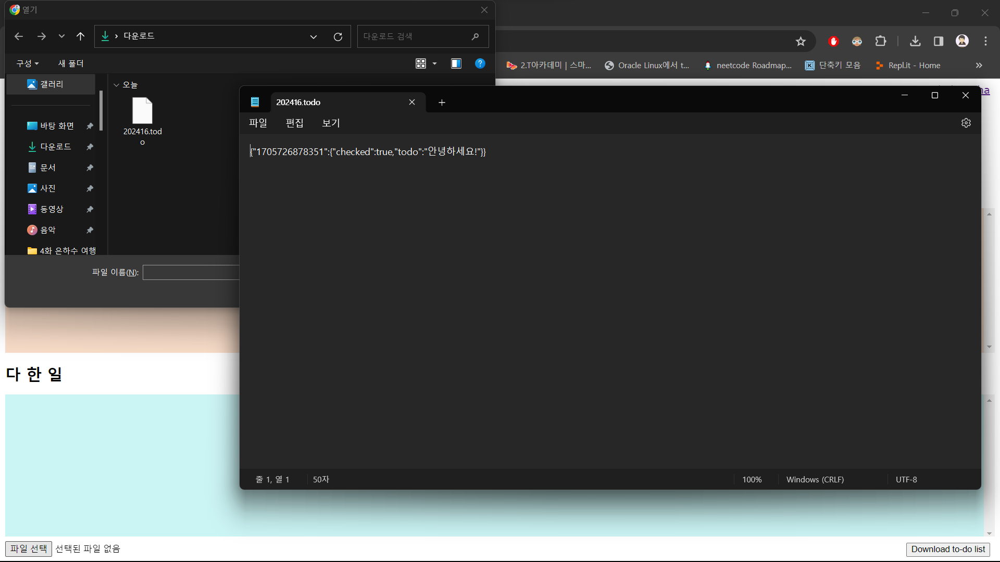
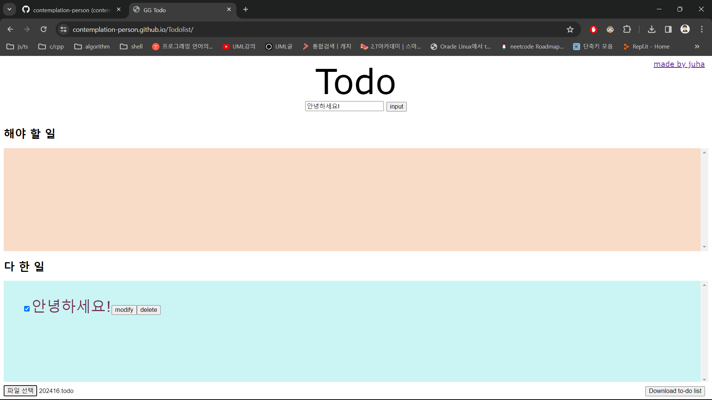

# 42gg 프론트엔드 온보딩 1단계

## 결과물 : [Todo](https://contemplation-person.github.io/Todolist/)

* 기본적인 입력, 삭제, 수정 구현
* 시간순으로 정렬
* 완료시 체크박스 체크 및 해야 할 일에서 다 한 일로 이동
* 해야할 일이 많을 시 스크롤 기능

* 저장 기능 구현

* 불러오기 기능 구현
* 불러오기 시 기존에 있던 데이터는 덮어씀

* localstorage를 이용하여 데이터 저장
* 새로고침 시에도 데이터 유지
* 껐다 키더라도 데이터 유지

배포됨 : [https://contemplation-person.github.io/Todolist/](https://contemplation-person.github.io/Todolist/)